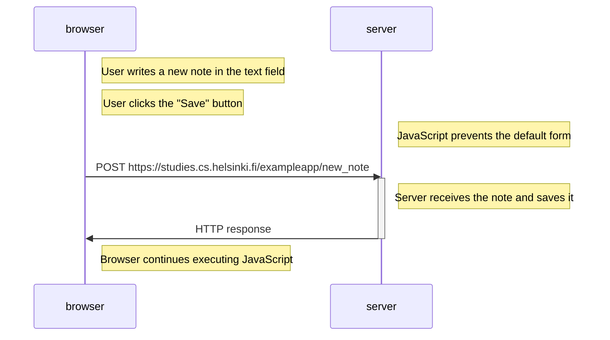

# 0.4: Create a note

```mermaid
sequenceDiagram
    participant browser
    participant server

    Note right of browser: User writes a new note in the text field
    Note right of browser: User clicks the "Save" button

    Note right of server: JavaScript prevents the default form

    browser->>server: POST https://studies.cs.helsinki.fi/exampleapp/new_note
    activate server

    Note right of server: Server receives the note and saves it

    server->>browser: HTTP response
    deactivate server

    Note right of browser: Browser continues executing JavaScript
```