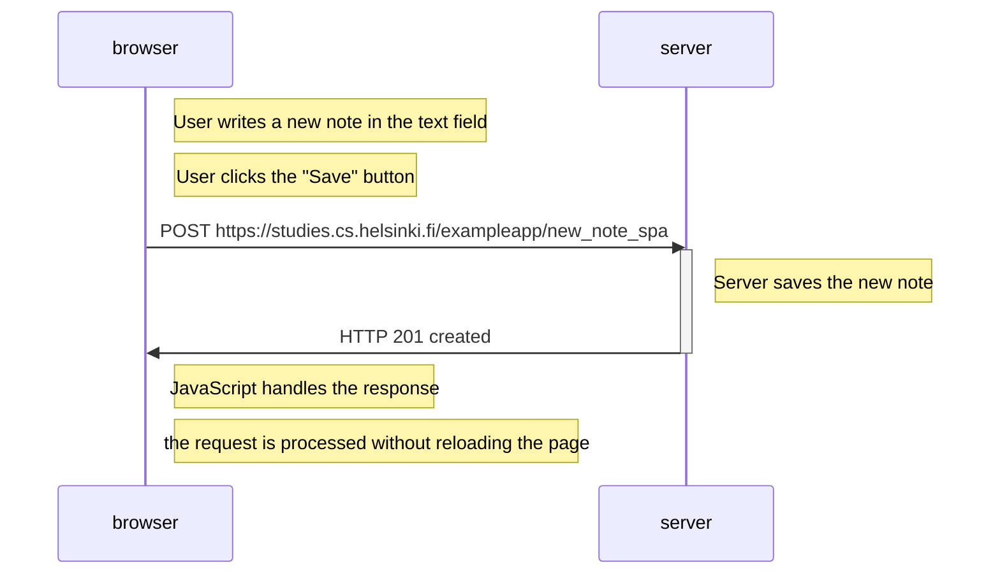

# 0.6: Create a note SPA

```mermaid
sequenceDiagram
    participant browser
    participant server

    Note right of browser: User writes a new note in the text field
    Note right of browser: User clicks the "Save" button

    browser->>server: POST https://studies.cs.helsinki.fi/exampleapp/new_note_spa
    activate server

    Note right of server: Server saves the new note
    server->>browser: HTTP 201 created
    deactivate server

    Note right of browser: JavaScript handles the response
    Note right of browser: the request is processed without reloading the page
```